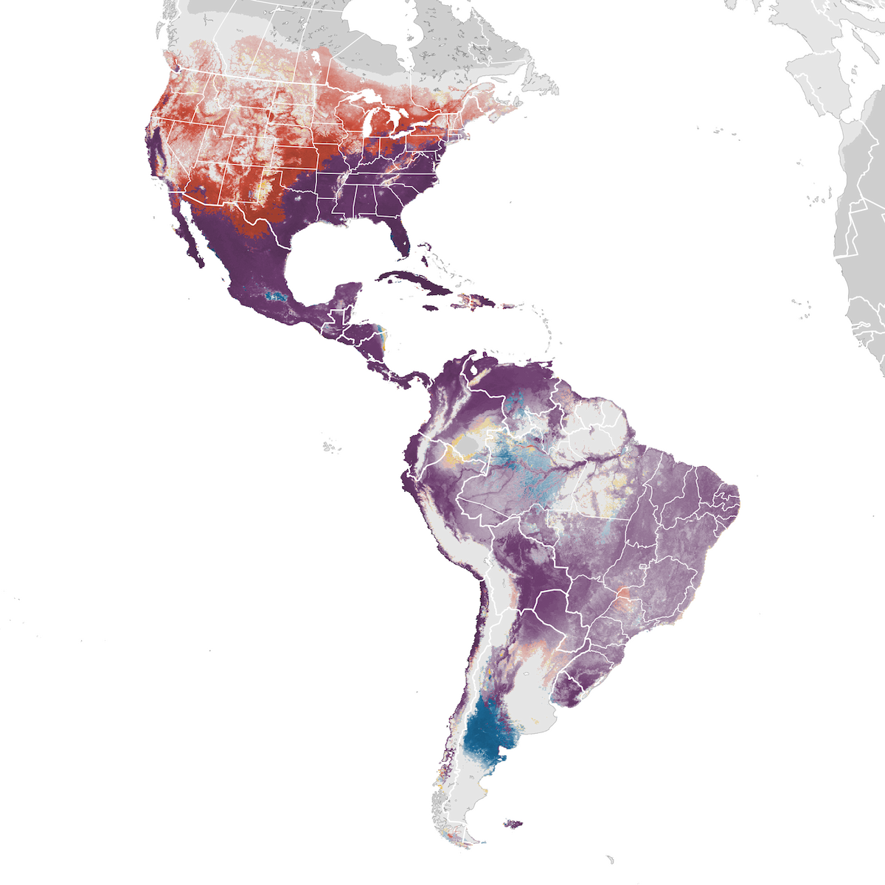

# Turkey vulture (Cathartes aura)

## Description

The Turkey Vulture (_Cathartes aura_) is a large, dark-plumaged New World vulture in the order Cathartiformes, family Cathartidae. Named for its resemblance to the Wild Turkey due to its bare, red head, the species is almost exclusively a scavenger (the genus name Cathartes means "purifier"). Adults are 62–81 cm (24–32 in) in total length with a wingspan of 160–183 cm (63–72 in) and weigh approximately 0.8–2.4 kg.

Sexes are similar in all plumages (no sexual dimorphism in plumage), though **females may be slightly larger on average**. Adults are entirely dark brown to blackish, with iridescent blue, purple, or green sheens on the neck and upper back. From below in flight, **the remiges and greater underwing coverts appear silvery-gray, creating a distinctive two-toned underwing pattern** (dark body and coverts, pale flight feathers). The head is bare and red in adults, with loose corrugated skin on the nape and crown; the bill is ivory-white.&#x20;

Juveniles have a grayish-black head with residual white or gray down, a darker bill with a black tip, and blacker body plumage with more iridescence. The head gradually becomes red through the first year. In flight,&#x20;

**Turkey Vultures hold their wings in a characteristic shallow dihedral (V-shape) and rock or teeter side to side, rarely flapping**. The long tail extends well beyond the trailing edge of the wings.

Nares are perforated like in other cathartidae.

### Subspecies

Five subspecies are recognized, distinguished by size, plumage, head coloration, geography, and migratory patterns:

_C. a. septentrionalis_ — breeds in eastern North America from southern Canada to the Gulf states; migratory, wintering from the southeastern US to South America.&#x20;

_**C. a. meridionalis**_ — the western subspecies, breeds from British Columbia and the western US south through western Mexico; highly migratory, wintering to South America. **This is the subspecies found in California.**&#x20;

_C. a. aura_ — resident in the Caribbean, southern Mexico, and Central America.&#x20;

_C. a. ruficollis_ — resident in tropical Central and South America.&#x20;

_C. a. jota (= falklandicus)_ — resident in temperate South America south to Tierra del Fuego and the Falkland Islands; some austral migration northward.

## Distribution and Migration

The Turkey Vulture is the **most widely distributed vulture in the Americas**, breeding from southern Canada to Tierra del Fuego. In North America, it breeds throughout the United States and into southern Canada. Three North American subspecies are partly migratory, with millions of the western subspecies (C. a. meridionalis) migrating to Central and South America for the winter. Eastern populations (C. a. septentrionalis) are also migratory. The species is one of the most spectacular migrants at hawk-watch sites; enormous concentrations pass through Central America, particularly at sites like Veracruz, Mexico, where counts can exceed millions of individuals per season. Peak autumn migration occurs September through November at most North American sites.

**In California, the Turkey Vulture is a common year-round resident in much of the state, especially in the southern and central regions. Populations in northern California are partially migratory, with some individuals wintering further south.** The species is abundant in open country with nearby forested areas for roosting and nesting. It is commonly seen soaring over the Central Valley, coastal ranges, foothills, and even suburban areas. Turkey Vultures form **large communal roosts**, sometimes numbering hundreds of individuals, particularly during migration and winter. California populations belong to the subspecies C. a. meridionalis.

<figure><figcaption>
eBird map. purple: year long, red: breeding, blue: non-breeding
</figcaption></figure>

## Diet and Biology

The Turkey Vulture is almost **exclusively a scavenger**, feeding on carrion of all sizes from small rodents to large ungulates. It **locates food primarily through its highly developed sense of smell, an unusual trait among birds, detecting ethyl mercaptan gas produced by decomposing flesh**. Turkey Vultures **prefer fresh carcasses and rarely feed on heavily decomposed remains**. They also occasionally consume insects, vegetable matter, and shoreline invertebrates. Their feeding behavior provides an important ecological service by removing carrion from the environment.

Turkey Vultures nest in dark recesses beneath boulders, on cliff ledges, in caves, hollow trees, logs, stumps, brush piles, and abandoned buildings. **No nest is constructed; eggs are laid directly on the substrate**. Clutch size is usually 2 eggs (occasionally 1, rarely 3). Eggs are creamy white with brown or lavender blotching. Incubation is 36–41 days, shared by both parents. Nestlings are altricial, covered in white down, and fledge at approximately 60–84 days. Both parents feed the young by regurgitation. Nest sites are often reused for many years. The species is long-lived, with individuals reaching 15+ years in the wild.

## Molting

The Turkey Vulture exhibits a **Simple Basic Strategy** with complete prebasic molts and no prealternate or preformative molts. Due to the large number of flight feathers (10 primaries, 16 secondaries, 12–14 rectrices), **molt is protracted and essentially year-round in adults, with suspension during breeding, migration, and winter as needed**. Primaries are replaced distally (p1 to p10), secondaries from three foci in a Staffelmauser-like pattern unique to New World vultures, allowing birds to maintain flight capability while replacing all primaries and most secondaries during each cycle. Rectrices molt bilaterally from r1 outward. **The complete replacement of all primaries takes approximately two years**. In North America, maximum numbers of missing remiges are seen in late May through late June, and by fall the flight silhouette is usually complete again. Juveniles undergo their first complete prebasic molt (second prebasic) from about February to October of their second year. Definitive adult appearance is attained with the second basic plumage.

## Biologic Data

| Parameter                  | Value                          | Notes                   |
| -------------------------- | ------------------------------ | ----------------------- |
| Body mass                  | 0.8–2.4 kg                     | Females slightly larger |
| Clutch size                | Usually 2 (range 1–3)          | 1 brood/year            |
| Incubation period          | 36–41 days                     | Both parents incubate   |
| Fledging age               | 60–84 days                     | —                       |
| Wingspan                   | 160–183 cm                     | —                       |
| Longevity (wild / captive) | 17+ yr (wild); 45 yr (captive) | —                       |
